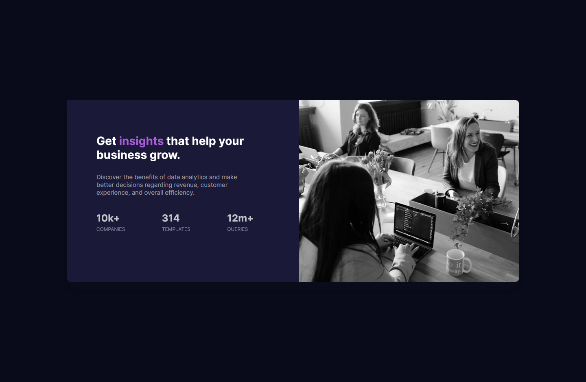

# Frontend Mentor - Stats preview card component solution

This is a solution to the [Stats preview card component challenge on Frontend Mentor](https://www.frontendmentor.io/challenges/stats-preview-card-component-8JqbgoU62). Frontend Mentor challenges help you improve your coding skills by building realistic projects.

## Table of contents

- [Overview](#overview)
  - [The challenge](#the-challenge)
  - [Screenshot](#screenshot)
  - [Links](#links)
- [My process](#my-process)
  - [Built with](#built-with)
  - [Useful resources](#useful-resources)
- [Author](#author)
- [Acknowledgments](#acknowledgments)

## Overview

### The challenge

Users should be able to:

- View the optimal layout depending on their device's screen size

### Screenshot

### Links

- Solution URL: https://github.com/yurtsevero/_Frontendmentor.stats-preview-card
- Live Site URL: https://yurtsevero.github.io/_Frontendmentor.stats-preview-card/

## My process

### Built with

- Semantic HTML5 markup
- BEM methodology
- CSS3 , SASS
- Flexbox, Grid Layout
- Mobile-first workflow

### Useful resources

- https://css-tricks.com/ - This helped me for how to use Flexbox . It is a great resource to have a look at it each time when I stuck in CSS.

## Author

- Linkedin- Onur Yurtsever - https://www.linkedin.com/in/oyurtsever/
- Frontend Mentor - @yurtsevero - https://www.frontendmentor.io/profile/yurtsevero
